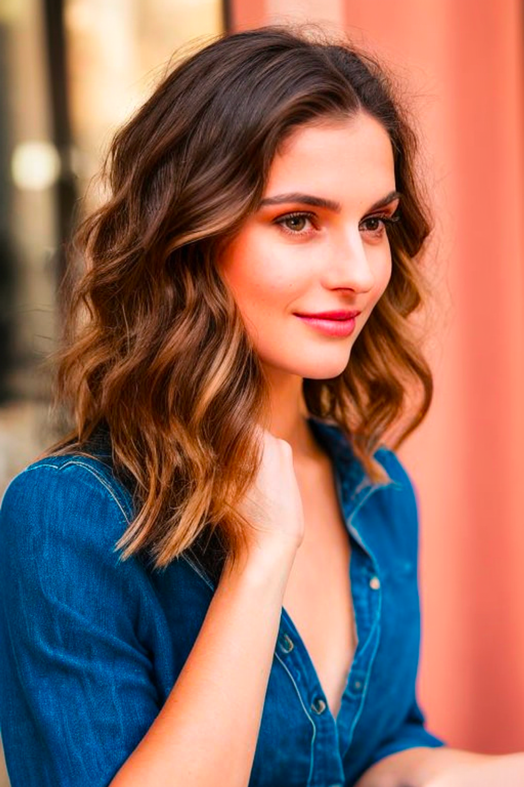

---
layout:
  title:
    visible: true
  description:
    visible: false
  tableOfContents:
    visible: true
  outline:
    visible: true
  pagination:
    visible: true
---

# Quick Start

See the [install guide](quick-start/installation-and-running.md)



Colab is Google’s interactive computing platform. We provide a notebook for you to run the Web-UI. You will need to subscribe to Colab Pro to use the Web-UI (\~$10/month)

**Pros**

✅ You don’t need to maintain your A1111 (it will have problems from time to time)

✅ Don’t use up your computer resources (models can be big)

✅ Cost effective if you account for hardware cost.

**Cons**

❎ Slower startup time.

**This is for you if**

👉 You want the most advanced features. \
👉 You don’t have the proper hardware or don’t want to use it.\
👉 You are tech-savvy enough to deal with model files. \
👉 You don’t mind paying a modest fee to use regularly.



You need a discrete NVIDIA graphic card with at least 4GB VRAM.

**Pros**

✅ Free

**Cons**

❎ Can take up a lot of your disk space.

❎ Not cheap if you decide to buy a good GPU card for it.

**This is for you if**

👉 You want the most advanced features. \
👉 You have the proper hardware on your PC and don’t mind using it for SD. \
👉 You are tech-savvy enough to install and maintain software on your PC. \
👉 You want a completely free solution.



You need Apple Silicon M1 or M2.

**Pros**

✅ Free

**Cons**

❎ Slower than PC

❎ Some features are not available

**This is for you if**

👉 You want the most advanced features but ok with some features being not available. \
👉 You have the right hardware on your PC and don’t mind using it for SD. \
👉 You are tech-savvy enough to install and maintain software on your PC. \
👉 You want a completely free solution. \
👉 You don’t mind image generation is a bit slow on Mac.



***

### Text-to-image Basics

Text-to-image is the most basic usage of Stable Diffusion. It is a model trained to turn text descriptions into images. For example, a text prompt, “a photo of an astronaut riding a horse on the moon” will produce an image just like that.

However, it could be challenging to generate precisely the image you want. We need to learn particular keywords it was trained on to entice it to give you what you want.

#### Three tips for building a good prompt

**💡 TIP 1: Be as detailed and as specific when describing a subject**


A woman sitting



A beautiful woman with blue eyes and blonde hair sitting outside in a restaurant


💡 TIP 2: Use names of artists and websites to modify the style


digital art



digital art, artstation, artgerm, alphonse mucha


**💡 TIP 3: Add lighting terms to make it more interesting**

* cinematic lighting
* studio lighting
* sunlight

Extra Tip: Always generate a few images with the same prompt to understand what the prompt can do!

### Fix Detects with Inpainting

It is uncommon to get a good image in one shot. You can use inpainting to fix defects. This is to ask Stable Diffusion to regenerate part of the image. See [Inpainting Basics](https://stable-diffusion-art.com/inpainting\_basics/) to get an overview.

### Try out these prompts

You will find a few ready-to-use prompts below. I just want to show you what Stable Diffusion can do. You don’t need to use the same model but you might get a different style.

<details>

<summary>A realistic person</summary>


```
photo of young woman, highlight hair, sitting outside restaurant, wearing dress, rim lighting, studio lighting, looking at the camera, dslr, ultra quality, sharp focus, tack sharp, dof, film grain, Fujifilm XT3, crystal clear, 8K UHD, highly detailed glossy eyes, high detailed skin, skin pores
```



```
disfigured, ugly, bad, immature, cartoon, anime, 3d, painting, b&w
```


Model: F222



</details>

<details>

<summary>A Witch</summary>


```
a witch, highly detailed face, half body, studio lighting, dramatic lighting, highly detailed clothing, looking at you, mysterious, dramatic lighting, (full moon:1.3), (beautiful fire magic: 1.2)
```



```
underage, immature, disfigured, deformed
```


Model: [Lyriel v1.5](https://civitai.com/models/22922/lyriel)


</details>

<details>

<summary>Paris in rainy fall</summary>


```
autumn in paris, city light, market, beautiful atmosphere, rain by thomas kinkade
```



```
ugly, tiling, poorly drawn hands, poorly drawn feet, poorly drawn face, out of frame, extra limbs, disfigured, deformed, body out of frame, bad anatomy, watermark, signature, cut off, low contrast, underexposed, overexposed, bad art, beginner, amateur, distorted face
```


Model: [Stable Diffusion 2.1](https://stable-diffusion-art.com/install-stable-diffusion-2-1/)

.png>)

</details>
