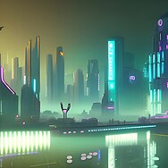

---
layout:
  title:
    visible: true
  description:
    visible: false
  tableOfContents:
    visible: true
  outline:
    visible: true
  pagination:
    visible: true
---

# Apa itu Stable Diffusion ?

Stable Diffusion adalah sebuah [model teks-ke-gambar](https://id.wikipedia.org/wiki/Model\_teks-ke-gambar) berbasis [kecerdasan buatan](https://id.wikipedia.org/wiki/Kecerdasan\_buatan), bagian dari [pemelajaran dalam](https://id.wikipedia.org/wiki/Pemelajaran\_dalam) yang dirilis pada tahun 2022. Umumnya digunakan untuk menghasilkan gambar berdasarkan deskripsi teks, namun dapat juga digunakan untuk hal terkait seperti teknik inpainting, outpainting, dan menghasilkan keluaran gambar-ke-gambar yang dipandu oleh [perintah kalimat](https://id.wikipedia.org/w/index.php?title=Perintah\_kalimat\&action=edit\&redlink=1). Model Ini dikembangkan oleh para peneliti dari kelompok CompVis di [Universitas Ludwig Maximilian München](https://id.wikipedia.org/wiki/Universitas\_Ludwig\_Maximilian\_M%C3%BCnchen) dan Runway dengan dukungan komputasi oleh Stability AI dan kumpulan data latih dari sejumlah organisasi nirlaba.

Stable Diffusion adalah model difusi laten, sebuah jenis [jaringan saraf tiruan](https://id.wikipedia.org/wiki/Jaringan\_saraf\_tiruan) generatif. Bobot kode dan modelnya telah dirilis secara publik, dan dapat berjalan di sebagian besar perangkat keras tipe konsumen yang dilengkapi dengan [kartu grafis](https://id.wikipedia.org/wiki/Unit\_pemroses\_grafis) sederhana dengan minimal kapasitas memori grafis sebesar 8 GB. Ini berbeda dari model teks-ke-gambar sebelumnya seperti [DALL-E](https://id.wikipedia.org/w/index.php?title=DALL-E\&action=edit\&redlink=1) dan [Midjourney](https://id.wikipedia.org/wiki/Midjourney) yang hanya dapat diakses melalui [layanan komputasi awan](https://id.wikipedia.org/wiki/Komputasi\_awan).

### Sejarah pengembangan

Pengembangan Stable Diffusion didanai dan didukung oleh perusahaan rintisan Stability AI. Lisensi teknis untuk model tersebut dirilis oleh kelompok CompVis di Universitas Ludwig Maximilian München. Pengembangan dipimpin oleh Patrick Esser dari Runway dan Robin Rombach dari CompVis, yang termasuk di antara para peneliti yang sebelumnya menemukan arsitektur model difusi laten yang digunakan oleh Stable Diffusion. Stability AI juga memberikan apresiasi terhadap [EleutherAI](https://id.wikipedia.org/wiki/EleutherAI) dan [LAION](https://id.wikipedia.org/wiki/LAION) (organisasi nirlaba Jerman yang mengumpulkan kumpulan data tempat pelatihan Stable Diffusion) sebagai pendukung proyek.

Pada Oktober 2022, Stability AI berhasil mengumpulkan US$101 juta dalam program pendanaan yang dipimpin oleh Lightspeed Venture Partners dan Coatue Management.

### Teknologi

#### Arsitektur

<figure><figcaption>
Diagram of the latent diffusion architecture used by Stable Diffusion
</figcaption></figure>

Stable Diffusion menggunakan sebuah jenis model difusi yang disebut model difusi laten yang dikembangkan oleh kelompok CompVis di Universitas Ludwig Maximilian München.

Dengan 860 juta parameter di U-Net dan 123 juta di enkoder teks, Stable Diffusion dianggap relatif ringan menurut standar tahun 2022, dan tidak seperti model difusi lainnya, model ini dapat berjalan pada kartu grafis tipe konsumen.

#### Data latih

Stable Diffusion dilatih pada pasangan gambar dan teks yang diambil dari LAION-5B, sebuah kumpulan data yang tersedia untuk umum yang berasal dari data [Common Crawl](https://id.wikipedia.org/w/index.php?title=Common\_Crawl\&action=edit\&redlink=1) yang diambil dari web, di mana 5 miliar pasangan gambar-teks diklasifikasikan berdasarkan bahasa dan disaring ke dalam kumpulan data terpisah berdasarkan resolusi, kemungkinan terdapatnya [tanda air digital](https://id.wikipedia.org/wiki/Penandaairan\_digital), dan skor "estetika" yang diprediksi (misalnya kualitas visual secara subjektif). Kumpulan data ini dibuat oleh [LAION](https://id.wikipedia.org/wiki/LAION), organisasi nirlaba Jerman yang menerima dana dari Stability AI. Model Stable Diffusion dilatih pada tiga himpunan bagian LAION-5B yaitu laion2B-en, laion-high-resolution, dan laion-aesthetics v2 5+. Analisis pihak ketiga terhadap data latih model menunjukan sekitar 47% dari ukuran sampel gambar berasal dari 100 domain web berbeda, dengan [Pinterest](https://id.wikipedia.org/wiki/Pinterest) mengambil 8,5% bagian, diikuti oleh situs web seperti [WordPress](https://id.wikipedia.org/wiki/WordPress), [Blogspot](https://id.wikipedia.org/wiki/Blogger\_\(layanan\)), [Flickr](https://id.wikipedia.org/wiki/Flickr), [DeviantArt](https://id.wikipedia.org/wiki/DeviantArt), dan [Wikimedia Commons](https://id.wikipedia.org/wiki/Wikimedia\_Commons).

<figure><figcaption>
The denoising process used by Stable Diffusion. The model generates images by iteratively denoising random noise until a configured number of steps have been reached, guided by the CLIP text encoder pretrained on concepts along with the attention mechanism, resulting in the desired image depicting a representation of the trained concept.
</figcaption></figure>

#### Prosedur pelatihan

Model ini awalnya dilatih pada subset laion2B-en dan laion-high-resolution, dengan beberapa putaran terakhir pelatihan dilakukan terhadap LAION-Aesthetics v2 5+, subset dari sekitar 600 juta gambar dengan judul yang diprediksi oleh LAION-Aesthetics Predictor V2 bahwa rata-rata manusia akan memberikan skor setidaknya 5 dari 10 berdasarkan penilaian seberapa besar mereka menyukainya. Subset LAION-Aesthetics v2 5+ juga mengecualikan gambar yang memiliki beresolusi rendah dan gambar yang diidentifikasi oleh LAION-5B-WatermarkDetection memiliki [tanda air digital](https://id.wikipedia.org/wiki/Penandaairan\_digital) dengan probabilitas lebih dari 80%.

Model ini dilatih menggunakan 256 kartu grafis Nvidia A100 di [Amazon Web Services](https://id.wikipedia.org/wiki/Amazon\_Web\_Services) dengan total 150.000 jam kartu grafis, dengan biaya sebesar US$600.000.

#### Keterbatasan

Stable Diffusion memiliki masalah dengan degradasi dan ketidakakuratan dalam skenario tertentu. Rilis awal model ini dilatih pada kumpulan data yang terdiri dari gambar beresolusi 512×512, yang berarti bahwa kualitas gambar yang dihasilkan menurun drastis saat spesifikasi pengguna menyimpang dari resolusi 512×512 yang "diharapkan"; versi 2.0 dari model Stable Diffusion kemudian memperkenalkan kemampuan untuk menghasilkan gambar secara alami pada resolusi 768×768. Tantangan lain adalah dalam menghasilkan anggota tubuh manusia karena kualitas data anggota tubuh yang buruk di data LAION (umumnya terlihat pada tangan). Keterbatasan pada Stable Diffusion mulai diatasi secara perlahan dengan model versi SDXL yang dirilis pada tanggal 26 Juli 2023, SDXL mendukung gambar beresolusi 1024x1024 dan menghasilkan anggota tubuh dan teks yang lebih sempurna.

Keterjangkauan untuk pengembang individu juga bisa menjadi masalah. Untuk menyesuaikan model untuk kasus penggunaan baru yang tidak termasuk dalam kumpulan data, seperti membuat karakter [anime](https://id.wikipedia.org/wiki/Anime) ("waifu difusion"), data baru dan pelatihan lebih lanjut diperlukan. Adaptasi penyempurnaan terhadap Stable Diffusion yang dibuat melalui pelatihan ulang tambahan telah digunakan untuk berbagai kasus penggunaan yang berbeda, mulai dari pencitraan medis hingga [musik yang dihasilkan dengan algoritma](https://id.wikipedia.org/w/index.php?title=Riffusion\&action=edit\&redlink=1). Namun, proses penyempurnaan ini sensitif terhadap kualitas data baru; gambar beresolusi rendah atau resolusi yang berbeda dari data asli tidak hanya dapat gagal mempelajari tugas baru tetapi juga menurunkan kinerja model secara keseluruhan. Bahkan ketika model dilatih lebih lanjut terhadap kumpulan gambar berkualitas tinggi, sulit bagi individu untuk menjalankan model dalam perangkat elektronik tipe konsumen. Misalnya, proses pelatihan waifu-diffusion membutuhkan minimal kapasitas memori grafis sebesar 30 GB, yang melebihi sumber daya yang disediakan di kartu grafis tipe konsumen.

Pencipta Stable Diffusion mengakui potensi [bias algoritma](https://id.wikipedia.org/w/index.php?title=Bias\_algoritme\&action=edit\&redlink=1), karena model tersebut dilatih pada gambar yang kebanyakan memiliki deskripsi bahasa Inggris. Akibatnya, gambar yang dihasilkan memperkuat bias sosial yang berasal dari perspektif budaya Barat, karena pembuatnya model tersebut kekurangan data dari komunitas dan budaya lain.

#### Penyempurnaan oleh pengguna akhir

Untuk mengatasi keterbatasan proses pelatihan awal model, pengguna akhir dapat memilih untuk melakukan pelatihan tambahan untuk menyempurnakan keluaran agar sesuai dengan kasus penggunaan yang lebih spesifik. Ada tiga metode di mana penyempurnaan oleh pengguna akhir dapat diterapkan:

* "Embedding" dapat dilatih dari kumpulan gambar yang disediakan oleh pengguna, dan memungkinkan model menghasilkan gambar yang mirip secara visual setiap kali nama sematan digunakan dalam perintah pembuatan. Penyematan didasarkan pada konsep "inversi tekstual" yang dikembangkan oleh para peneliti dari [Universitas Tel Aviv](https://id.wikipedia.org/wiki/Universitas\_Tel\_Aviv) pada tahun 2022 dengan dukungan dari [Nvidia](https://id.wikipedia.org/wiki/NVIDIA), di mana representasi vektor untuk token tertentu yang digunakan oleh pembuat enkode teks model ditautkan ke kata-kata semu baru. Penyematan dapat digunakan untuk mengurangi bias dalam model aslinya, atau meniru gaya visual tertentu.
* "Hypernetwork" adalah jaringan saraf pra-pelatihan kecil yang diterapkan ke berbagai titik dalam jaringan saraf yang lebih besar, dan mengacu pada teknik yang dibuat oleh pengembang [NovelAI](https://id.wikipedia.org/w/index.php?title=NovelAI\&action=edit\&redlink=1) Kurumuz pada tahun 2021, awalnya ditujukan untuk [model transformator](https://id.wikipedia.org/w/index.php?title=Transformer\_\(model\_pembelajaran\_mesin\)\&action=edit\&redlink=1) pembuatan teks. Hypernetwork mengarahkan hasil ke arah tertentu, memungkinkan model berbasis Stable Diffusion untuk meniru gaya seni seniman tertentu, bahkan jika seniman tersebut tidak dikenali oleh model aslinya; mereka memproses gambar dengan menemukan area kunci yang penting seperti rambut dan mata, lalu menambal area tersebut di ruang laten sekunder.
* [DreamBooth](https://id.wikipedia.org/w/index.php?title=DreamBooth\&action=edit\&redlink=1) adalah model generasi pembelajaran mendalam yang dikembangkan oleh para peneliti dari [Google Research](https://id.wikipedia.org/wiki/Google) dan [Universitas Boston](https://id.wikipedia.org/wiki/Universitas\_Boston) pada tahun 2022 yang dapat menyempurnakan model untuk menghasilkan keluaran yang dipersonalisasi dan presisi yang menggambarkan subjek tertentu, mengikuti pelatihan melalui serangkaian gambar yang menggambarkan subjek tersebut.

### Kemampuan

Model Stable Diffusion mendukung kemampuan untuk menghasilkan gambar baru dengan menggunkan perintah teks yang berisikan elemen-elemen yang akan disertakan atau dikecualikan dari keluaran. Gambar yang sudah ada dapat digambar ulang oleh model untuk menambahkan elemen baru yang berdasarkan sebuah perintah teks (proses ini dikenal sebagai "pembuatan gambar terpandu") melalui mekanisme difusi-denoising. Juga, model ini memungkinkan penggunaan perintah untuk mengubah gambar yang ada dengan teknik inpainting dan outpainting, ketika digunakan dengan antarmuka yang sesuai, yang mana tersedia dalam berbagai macam implementasi dengan sumber terbuka.

Stable Diffusion disarankan untuk dijalankan dengan 10 GB atau lebih memori grafis, namun pengguna yang memiliki kapasitas memori grafis lebih sedikit dapat memilih untuk memuat bobot dengan presisi [float16](https://id.wikipedia.org/w/index.php?title=Float16\&action=edit\&redlink=1) ketimbang bobot bawaan dengan presisi [float32](https://id.wikipedia.org/w/index.php?title=Float32\&action=edit\&redlink=1) dengan kompromi pada performa model yang lebih rendah.

#### Pembuatan Text to image

Demonstration of the effect of negative prompts on image generation

<table data-full-width="false"><thead><tr><th align="center">no negative prompt</th><th align="center">"green trees"</th><th align="center">"round stones, round rocks"</th></tr></thead><tbody><tr><td align="center"></td><td align="center"></td><td align="center"></td></tr></tbody></table>

Fitur pembuatan teks ke gambar dalam Stable Diffusion, yang dikenal sebagai "txt2img", menggunakan perintah teks dengan sejumlah parameter opsi yang mencakup jenis pengambilan sampel, dimensi gambar keluaran, dan nilai benih. Perintah mengeluarkan berkas gambar berdasarkan interpretasi model dari kalimat. Gambar yang dihasilkan ditandai dengan [tanda air digital](https://id.wikipedia.org/wiki/Penandaairan\_digital) yang tidak kasat mata untuk memungkinkan pengguna mengidentifikasi gambar yang dihasilkan oleh Stable Diffusion, meskipun tanda air ini dapat pudar jika gambar diubah ukurannya atau diputar.

Setiap generasi txt2img akan melibatkan nilai benih tertentu yang memengaruhi gambar keluaran. Pengguna dapat memilih untuk mengacak nilai benih untuk menjelajahi keluaran yang berbeda, atau menggunakan benih yang sama untuk mendapatkan keluaran gambar yang serupa dengan gambar yang dihasilkan sebelumnya. Pengguna juga dapat menyesuaikan jumlah langkah inferensi untuk sampler; nilai yang lebih tinggi membutuhkan durasi waktu yang lebih lama, namun nilai yang lebih kecil dapat menyebabkan timbulnya cacat visual pada keluaran. Opsi lain yang dapat dikonfigurasi adalah nilai skala panduan bebas pengklasifikasi, memungkinkan pengguna untuk menyesuaikan seberapa dekat gambar keluaran sesuai dengan perintah. Kasus penggunaan yang lebih eksperimental mungkin memilih nilai yang lebih rendah, sementara kasus penggunaan yang ditujukan untuk keluaran yang lebih spesifik mungkin menggunakan nilai yang lebih tinggi.

Fitur text2img tambahan disediakan oleh penerapan [front-end](https://id.wikipedia.org/wiki/Bagian\_depan\_dan\_bagian\_belakang\_\(komputasi\)) Stable Diffusion, yang memungkinkan pengguna untuk mengubah bobot yang diberikan ke bagian tertentu dari perintah teks. Metode alternatif untuk menyesuaikan bobot ke bagian perintah adalah "perintah negatif". Perintah negatif adalah fitur yang disertakan dalam beberapa implementasi front-end, termasuk layanan komputasi awan DreamStudio dan Clipdrop milik Stability AI dan layanan eksternal NightCafe Studio, dan memungkinkan pengguna untuk menentukan hal yang harus dihindari model selama pembuatan gambar. Perintah yang ditentukan mungkin merupakan fitur gambar yang tidak diinginkan yang seharusnya ada dalam keluaran gambar karena perintah positif yang diberikan oleh pengguna, atau karena bagaimana awalnya model dilatih, dengan contoh umum berupa tangan manusia yang berantakan.

#### Modifikasi gambar

|                 |         .png>)         |
| :-------------------------------------------------: | :--------------------------------------------------------: |
| Gambar orisinil yang dibuat di Stable Diffusion 1.5 | Gambar hasil modifikasi yang dibuat di Stable Diffusion XL |

Stable Diffusion juga menyertakan fitur lain, "img2img", yang menggunakan perintah teks, hubungan ke gambar yang ada, dan nilai kekuatan antara 0,0 dan 1,0. Fitur ini mengeluarkan gambar baru berdasarkan gambar yang sudah ada yang juga menampilkan elemen yang disediakan dalam perintah teks. Nilai kekuatan menunjukkan jumlah noise yang ditambahkan ke gambar keluaran. Nilai kekuatan yang lebih tinggi menghasilkan lebih banyak variasi dalam gambar.

Kemampuan img2img untuk menambahkan noise ke gambar asli membuatnya berpotensi berguna untuk [anonimisasi data](https://id.wikipedia.org/w/index.php?title=Anonimisasi\_data\&action=edit\&redlink=1) dan [augmentasi data](https://id.wikipedia.org/w/index.php?title=Augmentasi\_data\&action=edit\&redlink=1), di mana karakteristik visual data gambar diubah dan dianonimkan. Proses yang sama mungkin juga berguna untuk peningkatan resolusi gambar, di mana resolusi gambar ditingkatkan, dengan lebih banyak detil ditambahkan ke gambar. Selain itu, Stable Diffusion telah diujicoba sebagai alat untuk kompresi gambar. Dibandingkan dengan format [JPEG](https://id.wikipedia.org/wiki/JPEG) dan [WebP](https://id.wikipedia.org/wiki/WebP), metode terbaru yang digunakan untuk kompresi gambar dalam Stable Diffusion memiliki keterbatasan dalam mempertahankan teks dan wajah kecil.

Kasus penggunaan tambahan untuk modifikasi gambar melalui img2img ditawarkan oleh banyak implementasi front-end model Stable Diffusion. Inpainting melibatkan modifikasi selektif sebagian dari gambar yang ada dengan lapisan topeng yang disediakan pengguna, yang mengisi ruang bertopeng dengan konten yang baru dibuat berdasarkan kalimat yang diberikan. Model khusus yang untuk kasus penggunaan inpainting dibuat oleh Stability AI bersamaan dengan peluncuran Stable Diffusion 2.0. Sebaliknya, outpainting memperluas gambar melampaui dimensi aslinya, mengisi ruang kosong sebelumnya dengan konten yang dihasilkan berdasarkan kalimat yang disediakan.

Model dengan panduan kedalaman, bernama "depth2img", diperkenalkan dengan rilis Stable Diffusion 2.0 pada 24 November 2022; model ini menyimpulkan kedalaman gambar masukan yang disediakan, dan menghasilkan gambar keluaran baru berdasarkan perintah teks dan informasi kedalaman, yang memungkinkan koherensi dan kedalaman gambar masukan asli dipertahankan dalam keluaran yang dihasilkan.

#### ControlNet

ControlNet adalah sebuah arsitektur jaringan saraf yang dirancang untuk mengelola model difusi dengan memasukkan kondisi tambahan. Ini menduplikasi bobot blok jaringan saraf menjadi salinan "terkunci" dan salinan "dapat dilatih". Salinan "dapat dilatih" mempelajari kondisi yang diinginkan, sedangkan salinan "terkunci" mempertahankan model aslinya. Konvolusi nol" adalah konvolusi 1×1 dengan bobot dan bias diinisialisasi ke nol. Sebelum pelatihan, semua konvolusi nol menghasilkan output nol, mencegah distorsi yang disebabkan oleh ControlNet. Metode ini memungkinkan pelatihan pada perangkat berskala kecil atau bahkan perangkat pribadi.

### Rilis

Rilis model meliputi:

V1.4, Agustus 2022

V1.5, Oktober 2022

V2.0, November 2022

V2.1, Desember 2022

SDXL 1.0, Juli 2023

### Penggunaan dan kontroversi

Stable Diffusion tidak mengklaim hak cipta atas gambar yang dihasilkan dan secara bebas memberikan hak cipta pada gambar yang dihasilkan dari model kepada pengguna asalkan konten gambar tidak ilegal atau membahayakan individu. Kebebasan yang diberikan kepada pengguna atas penggunaan gambar telah menyebabkan kontroversi tentang etika kepemilikan, karena Stable Diffusion dan model generatif lainnya dilatih dari gambar yang dilindungi hak cipta tanpa persetujuan pemilik.

Karena gaya seni dan [komposisi](https://id.wikipedia.org/wiki/Komposisi\_\(seni\_rupa\)) tidak memiliki hak cipta, seringkali ditafsirkan bahwa pengguna Stable Diffusion yang menghasilkan gambar karya seni tidak dapat dianggap melanggar hak cipta terhadap karya visual yang serupa. Namun, individu yang digambarkan dalam gambar yang dihasilkan dapat dilindungi oleh hak kepribadian jika gambar mereka digunakan, dan kekayaan intelektual seperti logo merek yang dapat dikenali masih dilindungi oleh hak merek dagang. Namun, sejumlah seniman visual menyatakan kekhawatiran bahwa penggunaan luas perangkat lunak sintesis gambar seperti Stable Diffusion dapat berpotensi menyebabkan seniman manusia, bersama dengan fotografer, model, sinematografer, dan aktor, secara bertahap kehilangan viabilitas komersial terhadap pesaing berbasis [kecerdasan buatan](https://id.wikipedia.org/wiki/Kecerdasan\_buatan).

Stable Diffusion lebih permisif dalam jenis konten yang mungkin dihasilkan pengguna, seperti gambar kekerasan atau eksplisit secara seksual, dibandingkan dengan produk kecerdasan buatan generatif komersial lainnya. Mengatasi kekhawatiran bahwa model tersebut dapat digunakan untuk tujuan yang tidak pantas, CEO Stability AI, Emad Mostaque, berpendapat bahwa "\[itu] adalah tanggung jawab masyarakat, apakah mereka etis, bermoral, dan legal dalam cara mereka mengoperasikan teknologi ini", dan menempatkan kemampuan Stable Diffusion ke tangan publik akan menghasilkan teknologi yang memberikan manfaat, terlepas dari potensi konsekuensi negatifnya. Selain itu, Mostaque berpendapat bahwa niat dibalik tersedianya Stable Diffusion secara terbuka adalah untuk mengakhiri kontrol dan dominasi korporasi atas teknologi tersebut, yang sebelumnya hanya mengembangkan sistem kecerdasan buatan tertutup untuk sintesis gambar. Hal ini tercermin dari fakta bahwa batasan yang diterapkan oleh Stability AI pada konten yang dihasilkan pengguna dapat dengan mudah dilewati karena ketersediaan kode sumber.

### Gugatan

Pada Januari 2023, tiga seniman: Sarah Andersen, Kelly McKernan, dan Karla Ortiz mengajukan gugatan [pelanggaran hak cipta](https://id.wikipedia.org/wiki/Pelanggaran\_hak\_cipta) terhadap Stability AI, [Midjourney](https://id.wikipedia.org/wiki/Midjourney), dan [DeviantArt](https://id.wikipedia.org/wiki/DeviantArt), mengklaim bahwa perusahaan-perusahaan tersebut telah melanggar hak jutaan artis dengan melatih model kecerdasan buatan pada lima miliar gambar diambil dari web tanpa persetujuan dari seniman aslinya. Di bulan yang sama, Stability AI juga digugat oleh [Getty Images](https://id.wikipedia.org/wiki/Getty\_Images) karena menggunakan gambarnya dalam data pelatihan.

Pada Juli 2023, Hakim Distrik AS [William Orrick](https://id.wikipedia.org/w/index.php?title=William\_Orrick\_III\&action=edit\&redlink=1) menolak sebagian besar tuntutan hukum yang diajukan oleh Andersen, McKernan, dan Ortiz tetapi mengizinkan mereka mengajukan keluhan baru.

### Lisensi

Tidak seperti model lainnya seperti DALL-E, Stable Diffusion membuat kode sumbernya tersedia beserta dengan model (bobot pralatih). Lisensi yang berlaku adalah Creative ML OpenRAIL-M, sebuah lisensi kecerdasan buatan yang memiliki misi "bertanggung jawab sampai ke model". Lisensi ini melarang sejumlah kasus penggunaan, seperti tindakan kriminal, [fitnah](https://id.wikipedia.org/wiki/Fitnah), [pelecehan](https://id.wikipedia.org/wiki/Pelecehan), [doksing](https://id.wikipedia.org/wiki/Doksing), "mengeksploitasi ... anak di bawah umur", memberikan nasihat medis, membuat kewajiban hukum secara otomatis, memproduksi bukti hukum, dan "mendiskriminasi atau melakukan tindakan kekerasan terhadap individu dan kelompok berdasarkan ... perilaku sosial atau ... karakteristik pribadi atau kepribadian ... \[atau] kategori dan karakteristik yang dilindungi hukum". Pengguna memiliki hak cipta terhadap gambar keluaran dan diperkenankan menggunakannya secara komersial.
