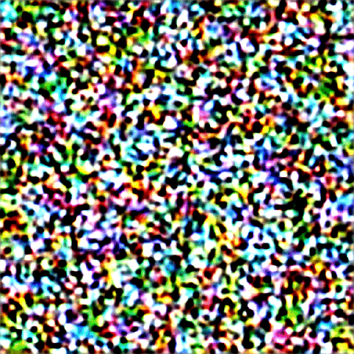
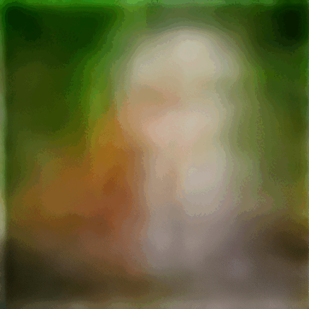

# Sampling method

## Penjelasan

Untuk menghasilkan gambar, Stable Diffusion pertama-tama menghasilkan gambar yang benar-benar acak dalam ruang laten. Prediktor noise kemudian memperkirakan noise pada gambar. Noise yang diprediksi dikurangi dari gambar. Proses ini diulangi belasan kali. Pada akhirnya, Anda mendapatkan gambar yang bersih.

Proses denoising ini disebut pengambilan sampel karena Stable Diffusion menghasilkan gambar sampel baru di setiap langkah. Metode yang digunakan dalam pengambilan sampel disebut metode sampler atau pengambilan sampel.

Di bawah ini adalah proses pengambilan sampel yang sedang bekerja. Sampler secara bertahap menghasilkan gambar yang semakin bersih.

<figure><figcaption>
Images after each denoising step.
</figcaption></figure>

## Noise schedule

Anda pasti sudah memperhatikan, bahwa gambar yang tadinya buram, secara bertahap berubah menjadi gambar yang jernih. Noise schedule mengontrol tingkat noise pada setiap langkah pengambilan sampel. Noise paling tinggi pada langkah pertama dan secara bertahap berkurang menjadi nol pada langkah terakhir.

Pada setiap langkah, tugas sampler adalah menghasilkan gambar dengan tingkat noise yang sesuai dengan noise schedule.

<figure><figcaption></figcaption></figure>

## Ancestral samplers

Apakah Anda melihat beberapa nama sampler memiliki satu huruf "a"?

* Euler a&#x20;
* DPM2 a
* DPM++ 2S a
* DPM++ 2S a Karras

Mereka adalah Ancestral samplers. Ancestral sampler menambahkan noise ke gambar pada setiap langkah pengambilan sampel. Mereka adalah sampler stokastik karena hasil pengambilan sampel memiliki keacakan.

Ketahuilah bahwa banyak sampler lain yang juga merupakan sampler stokastik, meskipun namanya tidak memiliki huruf "a".

Kelemahan dari penggunaan ancestral sampler adalah gambar tidak akan menyatu. Bandingkan gambar yang dihasilkan menggunakan Euler a dan Euler di bawah ini.

<figure><figcaption>
Euler a tidak konvergen. (sample steps 2 – 40)
</figcaption></figure>

<figure><figcaption>
Euler menyatu. (sampling steps 2-40)
</figcaption></figure>

Gambar yang dihasilkan dengan Euler a tidak menyatu pada langkah pengambilan sampel yang tinggi. Sebaliknya, gambar dari Euler menyatu dengan baik.

## Karras noise schedule

Sampler dengan label "Karras" menggunakan jadwal derau yang direkomendasikan dalam[ artikel Karras](https://arxiv.org/abs/2206.00364). Jika Anda mencermati dengan saksama, Anda akan melihat ukuran langkah noise yang lebih kecil di bagian akhir. Mereka menemukan bahwa hal ini meningkatkan kualitas gambar.\

<figure><figcaption>
Comparison between the default and Karras noise schedule.
</figcaption></figure>

## DDIM and PLMS

DDIM (Denoising Diffusion Implicit Model) dan PLMS (Pseudo Linear Multi-Step method) adalah sampel yang dikirimkan dengan Stable Diffusion v1. DDIM adalah salah satu sampel pertama yang dirancang untuk model difusi. PLMS adalah alternatif yang lebih baru dan lebih cepat dari DDIM.

Metode ini umumnya dianggap ketinggalan jaman dan tidak banyak digunakan lagi.

## DPM and DPM++

**DPM** (Diffusion probabilistic model solver) dan **DPM++** adalah sampel baru yang dirancang untuk model difusi yang dirilis pada tahun 2022. Mereka mewakili keluarga pemecah dengan arsitektur serupa.

**DPM** dan **DPM2** serupa kecuali **DPM2** yang merupakan orde kedua (Lebih akurat tetapi lebih lambat).

**DPM++** adalah peningkatan dari **DPM**.

**DPM adaptive** menyesuaikan ukuran langkah secara adaptif. Ini bisa lambat karena tidak menjamin penyelesaian dalam jumlah langkah pengambilan sampel.\

## UniPC

UniPC (Unified Predictor-Corrector) adalah sampler baru yang dirilis pada tahun 2023. Terinspirasi oleh metode prediktor-korektor dalam pemecah ODE, metode ini dapat menghasilkan gambar berkualitas tinggi dalam 5-10 langkah.\

## Kecepatan

<figure><figcaption>
Relative rending time of each method (lower the better)
</figcaption></figure>

Meskipun DPM adaptif berkinerja baik dalam konvergensi, DPM adaptif juga merupakan yang paling lambat.

Anda mungkin telah memperhatikan bahwa waktu rendering lainnya terbagi dalam dua kelompok, dengan kelompok pertama membutuhkan waktu yang hampir sama (sekitar 1x), dan kelompok lainnya membutuhkan waktu sekitar dua kali lebih lama (sekitar 2x). Hal ini mencerminkan urutan solver. Pemecah urutan ke-2, meskipun lebih akurat, perlu mengevaluasi denoising U-Net dua kali. Jadi mereka 2x lebih lambat.

## Perbandingan Sampling

<figure><figcaption></figcaption></figure>
